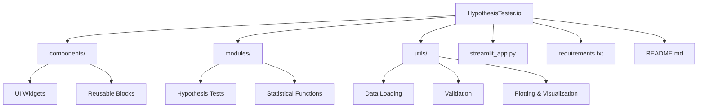

<!-- ============================================= -->
<!--            HypothesisTester.io README          -->
<!-- ============================================= -->

# 🧪 HypothesisTester.io  

[](https://www.python.org/)  
[](https://www.langchain.com/)  
[](https://deepmind.google/technologies/gemini/)
[](https://plotly.com/)  
[](https://streamlit.io/)  
[](LICENSE)  
[](CONTRIBUTING.md)  
[]()  

**HypothesisTester.io** is an interactive, AI-assisted tool built with **Streamlit** that enables data scientists, analysts, and students to perform hypothesis testing seamlessly. It combines statistical rigor with intuitive UI and visual explanations.

---

## 🚀 Why This Project?

- 🧠 **No-code testing** → Upload data & test hypotheses without writing boilerplate code.  
- 👨🏻‍🦱 **User Friendly** → You don't need extensive statistical knowledge to perform various Hypothesis Tests now.
- 📊 **Wide test coverage** → From t-tests to chi-square and ANOVA.  
- ✍️ **Human-readable insights** → Planned integration with LLMs for natural language explanations.  
- 🎯 **Cross-domain utility** → Finance, healthcare, education, marketing, psychology, and more.  

---

## 🏆 Why It Stands Out

Unlike static hypothesis test calculators, **HypothesisTester.io** leverages **prompt chaining + statistical computation**, making it both **AI-powered** and **statistics-grounded**. Perfect for students, data scientists, and researchers who want both automation and interpretability.

---

## ✨ Features

- 📊 **Statistical Tests Made Easy**: Supports t-tests, z-tests, chi-square tests, ANOVA, and more.

- 🤖**AI-Powered Prompt Chaining**: The app uses prompt chaining to interpret user queries in plain English and automatically map them to the correct hypothesis test. Example:
    
    - Input: *“Check if the average salary of men and women is significantly different.”*
    - Model Response: Chooses **two-sample t-test** and executes it.

- 🎯 Smart Test Selection: No need to remember test names — just ask your question, and the model decides the right test for you.

- 🌐 Clean & Interactive UI: Built for ease of use, with clear results and visual feedback.

---

## 🚀 Tech Stack

- **Frontend**: Streamlit
- **Backend**: Python (statsmodels, scipy)
- **AI Layer**: AI-powered prompt chaining for intelligent query-to-test mapping
- **Visualization**: Plotly

---

📸 Preview

---

## 🏗️ How It Works

1. User enters a plain English query *(e.g., “Is there a relationship between study time and exam scores?”)*.

2. The model processes the query through **prompt chaining** → identifies dependent/independent variables → selects correct hypothesis test.

3. App runs test and displays:
    - Null & alternative hypothesis
    - Test statistic & p-value
    - Clear conclusion

---

## 📂 Project Structure


---

## 🔧 Installation & Setup

> Works with **Python 3.10+**

```bash
# 1. Clone repo
git clone https://github.com/Shiv33ndu/HypothesisTester.io.git
cd HypothesisTester.io

# 2. Create virtual environment
python3 -m venv .venv
source .venv/bin/activate    # Linux/Mac
.venv\Scripts\activate       # Windows

# 3. Install requirements
pip install -r requirements.txt

# 4. Run app
streamlit run streamlit_app.py

```

👉 App will be available at: http://localhost:8501


---

## 🧩 Usage Workflow

1. Upload your dataset (.csv / .xlsx).
2. Pick variables & choose a hypothesis test.
3. Get results → test statistics, p-values, confidence intervals.
4. Visualize rejection regions & distributions.
5. (Planned) Ask AI for plain-English interpretations & recommendations.

---

## 🔍 Supported Tests

### ✅ Parametric

- One / Two-sample t-test
- Paired t-test
- ANOVA
- One-sample Z-test
- Proportion Z-test
- Linear Regression

### ✅ Nonparametric & Categorical

- Mann-Whitney U
- Wilcoxon signed-rank
- Kruskal–Wallis H
- Chi-square (goodness of fit, independence)
- Fisher’s exact


### ✅ Correlation

- Pearson
- Spearman

---

## 🤝 Contributing

Contributions are welcome!

- Fork repo
- Create feature branch
- Commit changes with clear messages
- Submit PR 🚀
- Bug reports, feature requests, or suggestions → open an Issue.

---

## 📝 License

This project is licensed under the MIT License.

---

## 👤 Author

**Shivendu Kumar**

💼 Data Scientist & ML Engineer | MLOps Enthusiast

---